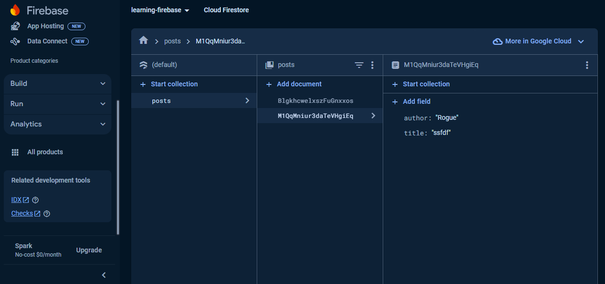
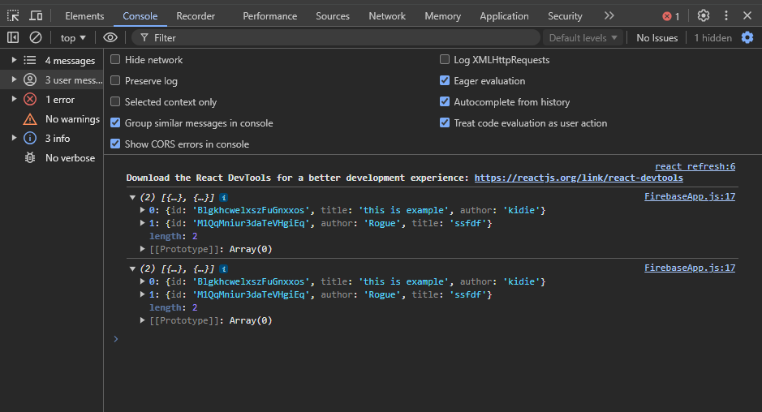

# Learning Firebase

## `1. Các set up đầu tiên `

- `npm i firebase`
- Tạo "firebase" (Folder)>"firebase-config.js" (File) trong Project
- Copy config từ trang Firebase, paste vào File firebase-config.js

## `2. firebase-config.js`

```
import { initializeApp } from "firebase/app";
import { getAuth } from "firebase/auth";
import { getFirestore } from "firebase/firestore";
// Change your config below
const firebaseConfig = {
  apiKey: "",
  authDomain: "",
  projectId: "",
  storageBucket: "",
  messagingSenderId: "",
  appId: "",
};

// Initialize Firebase
const app = initializeApp(firebaseConfig);
// Init services
export const db = getFirestore(app);
export const auth = getAuth(app);

```

## `3. getDocs - Truy xuất dữ liệu Collection`

```
import { collection, getDocs } from "firebase/firestore";
import React, { useEffect } from "react";
import { db } from "./firebase-config";

export default function FirebaseApp() {
  const colRef = collection(db, "posts");
  useEffect(() => {
    getDocs(colRef)
      .then((snapshot) => {
        let posts = [];
        snapshot.docs.forEach((doc) => {
          posts.push({
            id: doc.id,
            ...doc.data(),
          });
        });
        setPosts(posts);
        console.log(posts);
      })
      .catch((err) => {
        console.log(err);
      });
  });
}
```




## `4. onSnapshot - Truy xuất dữ liệu Collection realtime`

```
onSnapshot(colRef, (snapshot) => {
      let posts = [];
      snapshot.docs.forEach((doc) => {
        posts.push({
          id: doc.id,
          ...doc.data(),
        });
      });
      setPosts(posts);
    });
```

## `5. addDoc - Thêm Document vào Collection`

```
addDoc(colRef, {
    title, // data from State
    author, // data from State
    createdAt: serverTimestamp(),
  })
    .then(() => {
      console.log("succcess");
      // reset form
    })
    .catch((err) => {
      console.log(err);
      // reset form
    });
```

## `6. deleteDoc - Xoá Document khỏi Collection`

```
const handleRemoveDocument = async (e) => {
    e.preventDefault();
    // Get document ID
    const colRefDelete = doc(db, "posts", postId);
    await deleteDoc(colRefDelete);
  };
```

<!-- ### `1. Run các Service`
+ BlogService (port: 9092)
+ UserService (port: 9091)
+ AuthenticationService
+ ApiGateway (port: 9090)
+  -->
